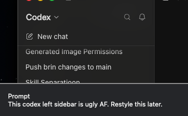

# SlopShot

A screenshotting app for agent harnessers 😬.

Bug screenshots usually need an explanation. Keeping that explanation somewhere else means tracking two pieces of context and matching them again later. SlopShot keeps them together: write or dictate a prompt after capture, and the app adds it to the image and its metadata. The resulting PNG is ready to give to an agent as one file.

SlopShot follows the native macOS screenshot interaction. It lives in the menu bar, saves captures to a chosen folder, and copies the finished image to the clipboard. A chained shortcut can focus the prompt and start your preferred dictation app after capture.

## Screenshot and metadata



The horizontal divider marks the end of the captured screen. Everything below it is the prompt footer added by SlopShot. The same prompt is embedded in the file:

```text
Description: This codex left sidebar is ugly AF. Restyle this later.
slopshot:CaptureId: 4D0CA7E4-AB31-4B98-892B-A41A451D8A3E
slopshot:SchemaVersion: 1
slopshot:Prompt: This codex left sidebar is ugly AF. Restyle this later.
slopshot:DisplayCount: 1
slopshot:DisplayIndex: 1
slopshot:VisualPromptEmbedded: true
slopshot:CapturedAt: 2026-08-11T17:03:08.936Z
```

Finder's Get Info window does not show embedded PNG Description or custom XMP fields. Its Comments box is a separate Finder attribute. Read the embedded fields with ExifTool:

```sh
exiftool -G1 -a -s \
  -Description \
  -XMP-slopshot:all \
  "Screenshot 2026-08-11 at 22.33.08.png"
```

## Install

SlopShot requires Apple silicon and macOS 14 or later.

```sh
curl -fsSL https://raw.githubusercontent.com/prashantbhudwal/slopshot/main/install.sh | sh
```

The installer downloads the latest release and verifies an Ed25519 release signature using a public key pinned in the installer. It then verifies the signed SHA-256 checksum, bundle identifier, arm64 executable, and ad-hoc code signature before installing at `~/Applications/SlopShot.app`. It keeps the previous app bundle beside the new one as a dated backup.

SlopShot is currently distributed as an ad-hoc signed prototype. macOS asks for Screen Recording access the first time it captures the screen. Chained shortcuts also need Accessibility access because SlopShot sends the recorded shortcut to another app.

## Use

The default shortcuts are:

| Shortcut | Action |
| --- | --- |
| `Command-Option-3` | Capture all displays |
| `Command-Option-4` | Capture an area or window |
| `Command-Option-5` | Capture an area or window, focus the prompt, then run the configured chained shortcut |

Area capture uses the macOS crosshair. Press Space to switch to window capture.

After capture, SlopShot shows the screenshot with a prompt field beneath it. Return saves to location one. Command-Return saves to location two. Both locations default to Desktop and can be changed in Settings. An untouched capture saves automatically after the configured delay. Every finished capture is also copied to the clipboard.

When visible prompts are enabled, SlopShot appends the prompt below the captured pixels with a clear divider. It also stores the same raw prompt in PNG metadata. Turning visible prompts off keeps the metadata and adds only a short pointer below the screenshot. A capture without a prompt is saved without a footer or SlopShot metadata.

## Build

```sh
./scripts/run-dev.sh
```

The app is a Swift 6 package. AppKit owns capture, global shortcuts, the menu-bar item, and the prompt panel. SwiftUI supplies Settings.

Run the verification suite with:

```sh
swift run SlopShotCoreTests
```

Build the signed arm64 archive and checksum with:

```sh
./scripts/package-release.sh 0.1.3
```

Tagged versions matching `v*` run the release workflow and publish `SlopShot-arm64.zip`, its SHA-256 checksum, the checksum's OpenSSH signature, and the installer script. The private Ed25519 key exists only in the `SLOPSHOT_RELEASE_SIGNING_KEY` GitHub Actions secret; the matching public key is bundled with the app and installer.

SlopShot remains ad-hoc signed and unnotarized. Release signatures authenticate updates independently of Apple's paid Developer ID and notarization services, while the stable ad-hoc designated requirement preserves local Screen Recording permission across builds.
